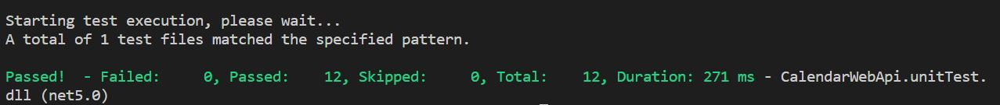
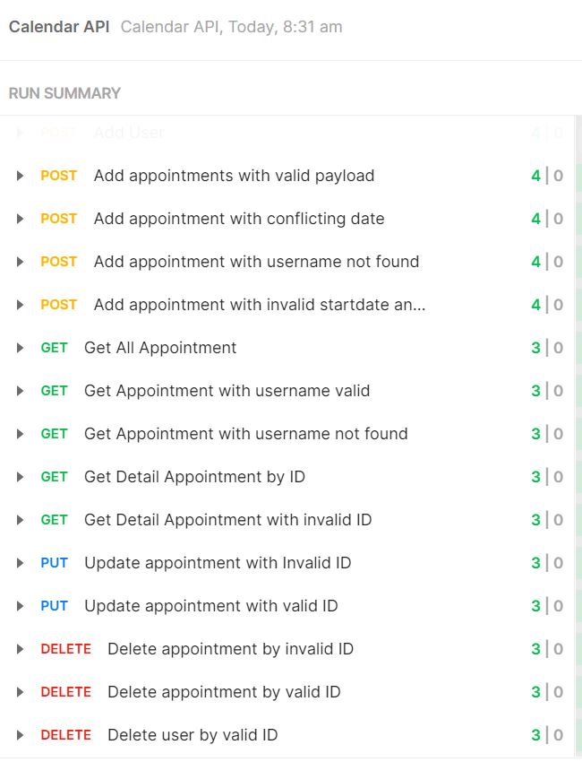
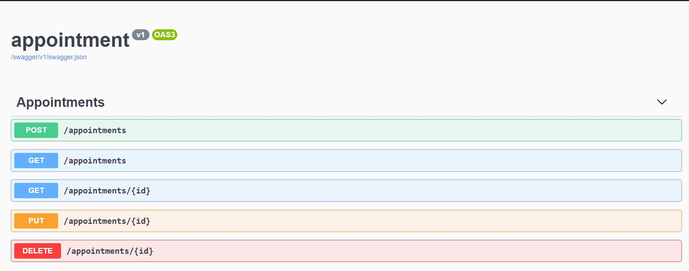


# Scarlett  Backend Test Coding

## CALENDAR API

## Environment Variables CALENDAR API

To run CALENDAR API, you will need to add the following variables to your appsetting.json file

`MongoDbSettings` `Host`  `Port` `User` 


## Features CALENDAR API

- Create User
- Get User by ID
- Get User by Username
- Update User
- Delete User
- Create Appointment
- Get Appointment
- Update Appointment
- Delete Appointment


## Deployment CALENDAR API
To module build
```bash
  cd CalendarWebApi.Api/
  dotnet build
```

To module run
```bash
  cd CalendarWebApi.Api/
  dotnet run
```
## Running with Docker
To build docker image
```bash
  cd CalendarWebApi.Api/
  docker build -t calendar:v1 .
```

To run container
```bash
  cd CalendarWebApi.Api/
  docker run -it --rm -p 8080:80 -e MongoDbSettings:Host=mongo calendar:v1
```

## Unit Testing
Using XUNIT
```bash
  cd CalendarWebApi.unitTest/
  dotnet test
```


## Integration Testing
Powered By Postman

**Please import the following 2 files into postman:**
```bash
  /postman/Calendar Api.api.postman_collection.json
  /postman/Calendar Api.api.postman_environtment.json
```



## Swager Documentation
Open URL
```bash
  https://localhost:5001/swagger
```



## Tech Stack

**Server:** C#,MongoDB, .Net 5


## Authors

- [@BayuAnggoroSakti](https://github.com/BayuAnggoroSakti)

